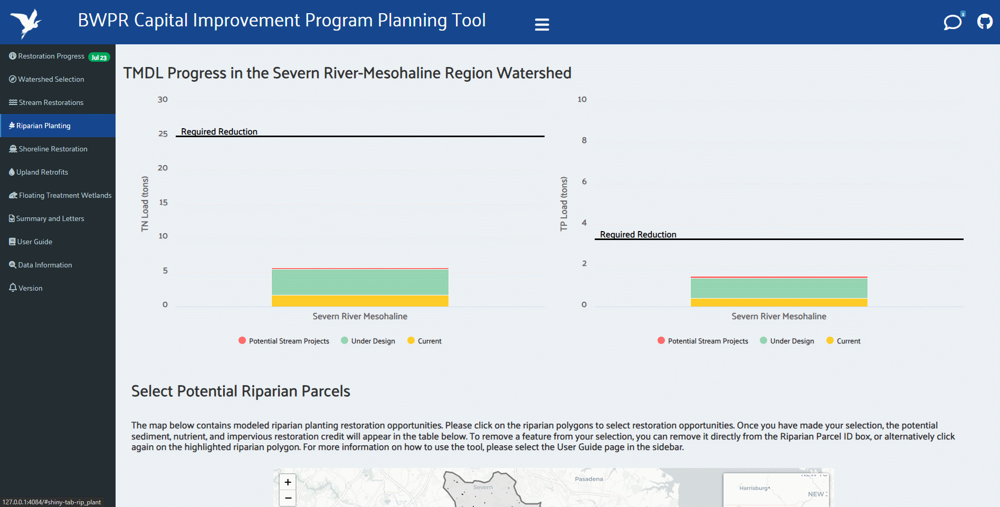

# Tool information 

This tool has been developed to assist planning for the Capital Improvement Program of the Bureau of Watershed Protection and Restoration (<https://www.aarivers.org>) at Anne Arundel County and their partners.  The purpose of the tool is to highlight the progress that has been made to Anne Arundel County’s MS4 permit and local TMDLs, identify and estimate sediment and nutrient reductions from potential restoration projects, and quantify how much these selected projects will achieve local TMDL goals.  Furthermore, the tool also allows the generation of letters to property owners to streamline project initiation and scoping. The tool can be found [here](https://www.aacounty.org/public-works/bwpr/watershed-assessment-planning/capital-improvement-program-planning-tool).

# Dashboard 

The tool contains a dashboard that displays the County’s progress to its 5th generation MS4 permit and local TMDLs goals. The user can hover over the charts that will show progress, as well as click on the legend to display and hide data. This functionality is shown in the animation below. 

 

    

   

# Using the Tool

   

## Watershed Selection

The dashboard will be the first thing you will see when loading the tool.  Navigation of the tool can be done using the side bar and additional options will appear in the sidebar depending on selections that the user makes. The first step is to select the watershed of interest. This can be done by clicking on ‘Watershed Selection’ in the sidebar.  This will reveal a new page with a map that can be clicked to reveal watershed identifying information. To select a watershed, navigate to the dropdown in the side bar and select your watershed of interest.  The map will then highlight and zoom to the watershed to confirm your choice.  You will notice that the number of options on the side bar will then increase and reveal different BMP types.  It’s important to note that the choice of your watershed will affect which BMP options are presented in the side bar.  For example, selecting a bay segment will reveal the option to select shoreline restoration.  This is because progress for the Bay TMDL is quantified at the Edge of Tide (EOT) scale, which is not the case for local TMDLs (Edge of Stream). If any BMP option is not presented, it is because that restoration opportunity is not present in that watershed.  The animation below shows how to use this part of the tool. 

 

    

   

## Stream Restoration

Once you have selected your watershed, you can navigate to the BMP selection options. The first option is ‘Stream Restorations’. Clicking on it in the side bar will open a page which an interactive bar chart(s) that demonstrates the current progress to the TMDL, a map with stream restoration opportunities, and a summary table of the selected items below.  When clicking a restoration segment, it will turn black and be added to the summary table below the map and the bar chart will be updated showing the selected stream restoration features. To deselect, simply click the feature again or delete the ID from the ‘Stream Segment ID’ box above the table.  It should be noted that some watersheds do not have a bar chart showing the TMDL progress – this is due to those watersheds not having a TMDL. An example of selecting stream restorations is shown in the animation below. 

 

    

  

## Riparian Planting

Clicking on ‘Riparian Planting’ in the side bar will open a page which an interactive bar chart(s), that demonstrate the current progress to the TMDL, and other BMP opportunities you’ve selected in previous pages, a map with riparian planting opportunities, and a summary table of the selected items below.  When clicking a riparian planting feature, it will turn black and be added to the summary table below the map and the bar chart will be updated showing the selected riparian planting features. To deselect, simply click the feature again or delete the ID from the ‘Riparian Parcel ID’ box above the table.  There is also the option to select two planting options – 'Riparian Forest Buffers' and 'Riparian Conservation Landscaping'.  It should be noted that some watersheds do not have a bar chart showing the TMDL progress – this is due to those watersheds not having a TMDL. An example of selecting riparian planting opportunities is shown in the animation below. 

 

    

  

## Shoreline Restoration

Clicking on ‘Shoreline Restoration’ in the side bar will open a page which an interactive bar chart(s), that demonstrate the current progress to the TMDL, and other BMP opportunities you’ve selected in previous pages, a map with shoreline restoration opportunities, and a summary table of the selected items below.  When clicking a restoration segment, it will turn black and be added to the summary table below the map and the bar chart will be updated showing the selected shoreline restoration features. To deselect, simply click the feature again or delete the ID from the ‘Shoreline Segment ID’ box above the table.  It should be noted that some watersheds do not have a bar chart showing the TMDL progress – this is due to those watersheds not having a TMDL. An example of selecting shoreline restorations is shown in the animation below. 

 

    

  

## Upland Retrofits

Clicking on ‘Upland Retrofits’ in the side bar will open a page which an interactive bar chart(s), that demonstrate the current progress to the TMDL, and other BMP opportunities you’ve selected in previous pages, a map with upland retrofit opportunities, and a summary table of the selected items below.  When clicking a retrofit point, it will turn black and be added to the summary table below the map and the bar chart will be updated showing the selected retrofit features. To deselect, simply click the feature again or delete the ID from the ‘Upland Retrofit ID’ box above the table.  It should be noted that some watersheds do not have a bar chart showing the TMDL progress – this is due to those watersheds not having a TMDL. An example of selecting upland retrofits is shown in the animation below. 

 

    

  

## Floating Treatment Wetlands

Clicking on ‘Floating Treatment Wetlands’ in the side bar will open a page which an interactive bar chart(s), that demonstrate the current progress to the TMDL, and other BMP opportunities you’ve selected in previous pages, a map with floating treatment wetland opportunities, and a summary table of the selected items below.  When clicking a floating treatment wetland feature, it will turn black and be added to the summary table below the map and the bar chart will be updated showing the selected floating treatment wetland features. To deselect, simply click the feature again or delete the ID from the ‘Floating Treatment Wetland ID’ box above the table.  The user also has the option to specify the level of pond surface area that is covered by the floating treatment wetland.  The higher the percent coverage, the larger the nutrient and sediment reductions resulting from this practice.  It should be noted that some watersheds do not have a bar chart showing the TMDL progress – this is due to those watersheds not having a TMDL. An example of selecting floating treatment wetlands is shown in the animation below. 

 

    

  

## Summary and Letters

Once you have selected all of the restoration opportunities in the watershed, you can navigate to the ‘Summary and Letters’ page using option in the side bar.  This page displays the total sum of nutrients, sediment, and impervious acres treated for all projects selected and allows the user to download project initiation letters to the property owners.  Clicking the ‘Generate Letters’ button will generate letters addressed to each property owner of the selected projects in a zip file. Letters should be tailored to each property owner with the information carefully reviewed.  Some inputs are required before sending these letters out to property owners, such as project number and contact information of the project manager. Please note that depending on the number of projects selected and the number of property owners, it may take a few moments to compile and save all of the letters. The animation below shows how this works. 

 

    

  

# Data Information

The 'Data Information' page gives a summary of the methods used to generate estimate of nutrient, sediment, and impervious treatment for each of the BMP options available for selection in the tool. 

# Version

The 'Version' page documents changes to the tool over time. 
